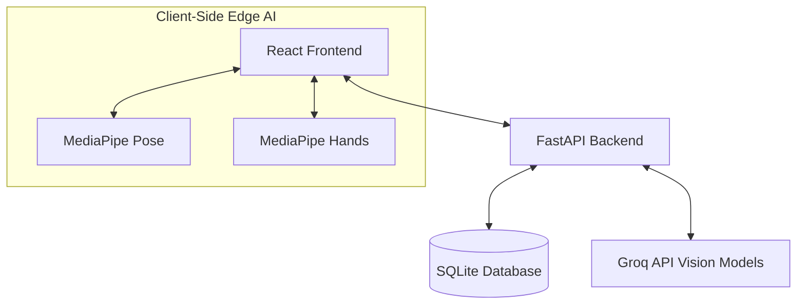

# Fitness Tracker Architecture

## 1. High-Level Architecture Overview

The AI-Powered Fitness Tracker is built on a modern, decoupled client-server architecture:
- **Frontend (Client):** React (Vite) + Tailwind CSS + MediaPipe
- **Backend (Server):** FastAPI (Python) + SQLite
- **AI Integration:** Groq (Llama 3.2 Vision / Qwen) for remote processing, Google MediaPipe for edge processing.

## 2. Frontend Architecture (React)

The frontend handles the user interface, real-time webcam streams, and edge AI processing.

* **Core Framework:** React 18 with Vite for lightning-fast HMR and building.
* **Styling:** Tailwind CSS for utility-first, highly responsive, and modern UI design.
* **State Management:** React `useState` and `useRef` for high-frequency updates (especially in the camera loop to prevent re-renders).
* **Edge AI (Computer Vision):**
  * `window.Pose`: MediaPipe Pose used for body tracking (squats, bicep curls) at 30+ FPS entirely in the browser.
  * `window.Hands`: MediaPipe Hands used for real-time finger signal detection.

## 3. Backend Architecture (FastAPI)

The backend serves as a secure bridge to external APIs and manages persistent user data.

* **Core Framework:** FastAPI for asynchronous, high-performance API endpoints.
* **Database:** SQLite (via SQLAlchemy or raw queries) for storing user profiles, workout histories, and food logs.
* **AI Service Module (`ai_service.py`):**
  * Intercepts Base64 images from the frontend.
  * Dynamically fetches available multimodal models from Groq.
  * Implements fallback logic (e.g., routing to `qwen-2.5-vl` if `llama-3.2-11b-vision` is unavailable).
  * Prompts the AI and returns structured JSON responses (e.g. food vision parsing returns total portion weight in grams `serving_weight_g`, itemized ingredient breakdowns with `weight_g` & `calories`, and `scientific_notes`).

## 4. Hybrid AI Strategy

The system utilizes a **Hybrid AI Strategy** to balance speed and intelligence:

1. **Edge AI (Zero Latency):** Tasks requiring real-time feedback (rep counting, form correction, finger signal detection) are executed entirely on the user's device using lightweight MediaPipe models. No data is sent to the server during active sets.
2. **Cloud AI (High Intelligence):** Tasks requiring deep reasoning and object recognition (food macro analysis, physique estimation, equipment scanning) are sent to the cloud via Groq's high-parameter vision models.
