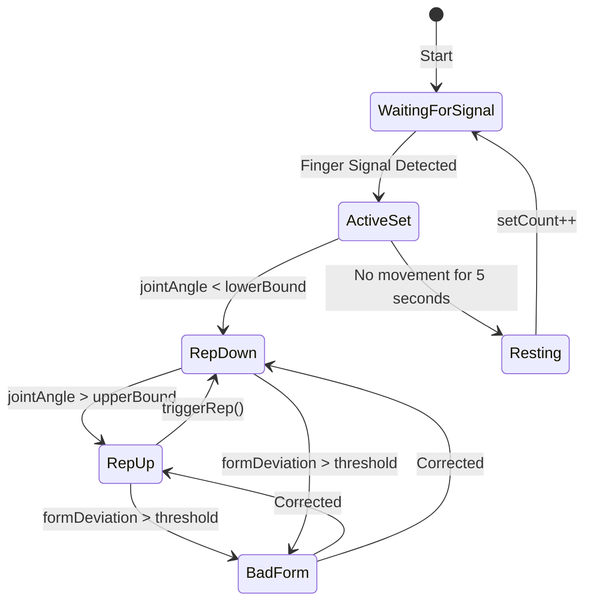
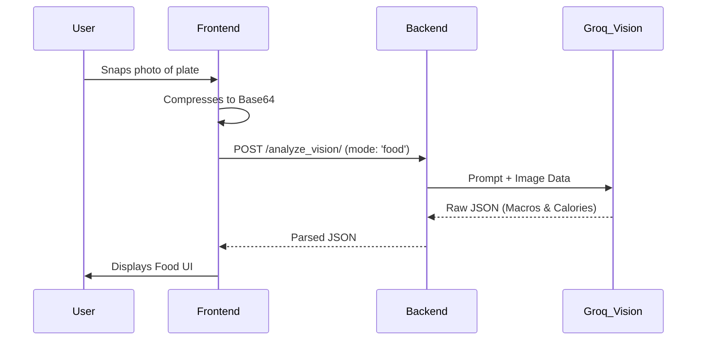

# Logical Flows

## 1. AI Form Coach - Logical Flow & State Machine

The Form Coach operates on a complex state machine that dictates when to count reps, when to wait for signals, and when to correct form.

### Finger Signal Logic (Dynamic Sets)
1. System enters `WaitingForSignal` state. `waitingForSignal = Math.min(setCount, 5)`.
2. MediaPipe Hands scans the frame. Calculates distance from wrist to fingertips to determine extension. Calculates distance from pinky base to thumb tip for thumb extension.
3. If `detected_fingers === waitingForSignal` for 3 consecutive frames, unlock the set and resume pose tracking.

### Form Correction Logic
* **Bicep Curls:** Calculates the angle between Hip -> Shoulder -> Elbow. If this angle exceeds 35°, the user is swinging their arm to cheat. The skeleton turns red.
* **Squats:** Calculates the angle between Shoulder -> Hip -> Knee. If this angle drops below 60°, the user's chest is caving forward. The skeleton turns red.

## 2. Auto-Food Logger Flow

